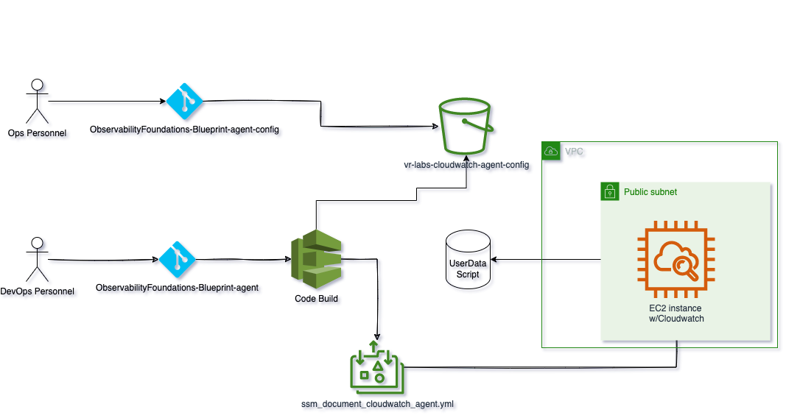

# Monitoring-Foundations-Cloudwatch-Blueprint

## Purpose
The purpose of the Monitoring Cloudwatch Foundations is to provide a foundational example of a dynamic cloudwatch process utilizing AWS services.

### Overview
For financial services organizations, monitoring is critical. In this solution, we will utilize a dynamic Cloudwatch Agent configuration file to aid in controlling metrics being output from many EC2 instances. This configuration file can be dynamically updated from Operations personnel.

### Architecture
The following diagram illustrates the architecture of the Cloudwatch Agent config Pipeline:

### Architecture Flow:
- A person updates the configuration file in a Git repo(GitHub)
- The update triggers a CodeBuild pipeline that copies the config file to a shared S3 bucket location
- Once the file is copied, the CodeBuild pipeline triggers a Systems Manager document to "push" this file down to all EC2 instances with a certain tag 
- After the file is pushed down to the EC2 instance, the Cloudwatch Agent is restarted so that it ingests the new configuration file
- After the Cloudwatch Agent is restarted, the new configuration file will be used

## Prerequisites
- You must have Python 3.8 or later installed and configured
- You must have AWS CDK installed and configured
- You must have your ~/.aws/credentials file configured with the appropriate profile
- You must clone this repository `https://github.com/VerticalRelevance/MonitoringFoundations-Blueprint`
- You must clone this repository - it's adjacent config file repository - `https://github.com/VerticalRelevance/MonitoringFoundations-Blueprint-agent-config`
- A GitHub account
- You must use a personal access token from GitHub to connect to the OAuth provider (https://docs.aws.amazon.com/cdk/api/latest/docs/aws-codepipeline-actions-readme.html#github) 

## Pre-Deployment(Configuration)
The following are modifications to the code you must perform to have it work for your environment
### app.py
 - Line 56: Choose the tag for the EC2 instances that you want to ingest this new Cloudwatch Agent configuration file
 - Line 78: Change the bucket name to your specific S3 location
 - Line 90: Change the bucket resource name to match your S3 location
 - Line 99: Change the `owner` to the owner of the repository
 - Line 100: Change the `repo` to the location of your configuration file repository
 - Line 102: Create a personal access token from GitHub and upload it here. The secrets manager name of the secret and `json_field` can be customized to your liking
 - Line 163: Update the S3 bucket to your Cloudwatch Agent configuration file location
 - Line 164: Modify the `Environment` tag with the tag you want to use for EC2 instance Cloudwatch update

### ssm_document_cloudwatch_agent.yml
 - Line 10: Update with correct S3 agent config bucket

## Deployment
Once all prerequisites have been satisfied, perform the following operations to deploy the project:

1) Run the command `cdk deploy --all` to deploy all the stacks.
2) On first run, the CodePipeline will update and push the Cloudwatch agent configuration document
3) Update the configuration file in the adjacent config repo
4) Observe that the new document has been pushed to all EC2 instances with provided tag

If everything is installed and configured correctly on the deployment EC2, the Data Pipeline components will now be deployed into the target account.

## Teardown
Ensure you have the appropriate credentials configured and perform the following step to tear down the dynamic Cloudwatch Agent configuration solution:

1) Run the command `cdk destroy --all` to teardown all the deployed resources.

All deployed resources should now be removed from the target account.

